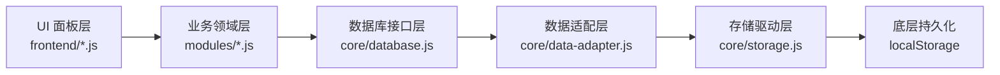

# Xiaohuhu Work Space · AI 开发者全景交接手册 (AI Development Guide)

> 📌 **致未来的 AI 开发者 / Agent**：
> 本文档是 Xiaohuhu Work Space（小呼呼个人数字工作空间）的权威架构全景与开发交接文档。
> 当你接手本项目进行后续功能迭代、模块扩展或 Bug 修复时，**请务必通读并严格遵守本手册中的架构铁律与数据分层规范**。

---

## 1. 项目概况与部署信息

- **项目名称**：Xiaohuhu Work Space（小呼呼个人数字工作空间）
- **核心定位**：脱离第三方商业平台依赖、数据完全自主掌控的长期个人数字工作台（日常任务、日历日程、科研记录、文献阅读、工作日志、多端同步）。
- **当前版本**：`v1.4.1`（Schema: `1`）
- **代码仓库**：`renhaow89/xiaohuhu-work-space`（主分支：`main`）
- **线上部署地址**：
  * 🌍 国内直连（GitHub Pages）：`https://renhaow89.github.io/xiaohuhu-work-space/`
  * ⚡ 海外 CDN（Vercel）：`https://xiaohuhu-work-space.vercel.app/`
  * 🧪 自动化测试套件：`https://renhaow89.github.io/xiaohuhu-work-space/frontend/test.html`

---

## 2. 核心开发铁律 (Architecture Iron Rules)

请在修改代码前牢记以下四大原则，**任何违背这些原则的代码修改均被视为严重架构破坏**：



1. **纯原生零构建工具原则（Zero Build Tools）**：
   * 本项目采用纯原生 **HTML5 + CSS3 + ES Modules (`import`/`export`)** 开发。
   * **严禁引入 Webpack、Vite、Rollup、Babel 或任何 npm 打包构建工具**。
   * 所有脚本直接在浏览器原生执行，确保随处克隆即可秒开运行。
2. **数据层严格单向分层（Strict Data Layering）**：
   * 严禁在 `frontend/*.js` 或 `modules/*.js` 中直接读写 `localStorage`！
   * 业务层统一调用 `Database.get(key, defaultVal)`、`Database.set(key, val)`、`Database.append(key, item)`、`Database.remove(key)`。
3. **统一版本与 Schema 单一事实源（Single Source of Truth）**：
   * `core/version.js` 是全系统的版本号（`version`）和数据模型版本（`schema`）的**唯一真相源**。
   * 变更版本时只需修改 `core/version.js`，其他模块通过导入读取。
4. **GitHub 独立 Commit 规范**：
   * 修改任何文件前，必须先通过 GitHub API 获取该文件的最新 `sha`。
   * 每实现一个独立功能，执行一次原子 Git Commit（语义化前缀：`feat:`、`fix:`、`test:`、`chore:`、`style:`、`refactor:`、`docs:`）。

---

## 3. 系统目录全景与模块职责

```
xiaohuhu-work-space/
├── core/                         # 核心框架底座层 (Core Infrastructure)
│   ├── version.js                # 统一版本与 Schema 真相源 (当前: v1.4.1, schema: 1)
│   ├── config.js                 # 全局单例配置
│   ├── storage.js                # 底层 localStorage 安全读写封装
│   ├── data-adapter.js           # 数据序列化、反序列化与容错适配器
│   ├── database.js               # 面向业务的异步数据库统一 API (派发 EventBus 事件)
│   ├── backup.js                 # 全量 JSON 备份导出、导入与校验恢复引擎
│   ├── backup-history.js         # 备份历史审计记录管理
│   ├── migration.js              # 数据 Schema 链式迁移流水线
│   ├── sync-manager.js           # Supabase 邮箱认证、心跳轮询、墓碑追踪与双向合并引擎
│   ├── event.js                  # 全局 PubSub 事件总线 (EventBus)
│   └── model.js                  # 基础数据实体模型
│
├── modules/                      # 业务领域模块层 (Business Domains)
│   ├── task.js                   # 任务管理（优先级/跨天时间段/定点提醒/置顶聚焦点/多行换行）
│   ├── schedule.js               # 日历日程（按日/月检索、全天/时段、分类标签）
│   ├── journal.js                # 工作日志（分类标签/时间线逆序流）
│   ├── reading.js                # 文献与书籍阅读（评分/状态/读书笔记）
│   ├── research.js               # 科研实验记录（Markdown/标签管理/附件记录）
│   ├── review.js                 # 周期复盘（周/月/年复盘骨架）
│   └── finance.js                # 财务记账骨架
│
├── frontend/                     # 用户界面与交互层 (Presentation Layer)
│   ├── index.html                # 主工作台 SPA 骨架（110px 桌面 / 62px 移动端左侧侧边栏）
│   ├── style.css                 # 温暖粉橙设计系统、圆角阴影、移动端左侧紧凑手账排版
│   ├── main.js                   # 前端启动引导器，注册 PWA Service Worker (含 controllerchange 自动重载)
│   ├── dashboard.js              # 单面板导航切换控制器、顶部动态中文日期
│   ├── task-panel.js             # 任务面板 UI（置顶卡片、双日期时间选择、Toast 提醒、多行换行）
│   ├── calendar-panel.js         # 日历日程面板 UI（月历网格、全景回顾）
│   ├── journal-panel.js          # 日志面板 UI
│   ├── reading-panel.js          # 阅读面板 UI
│   ├── research-panel.js         # 科研面板 UI
│   ├── file-panel.js             # 文件索引面板 UI
│   ├── settings-panel.js         # 设置面板 UI（云同步配置、邮箱登录、内置保姆级教程）
│   ├── sw.js                     # PWA Service Worker（NetworkFirst 策略与断网降级回退）
│   ├── manifest.json             # PWA 独立安装配置
│   ├── icons/                    # PWA 矢量图标 (icon-192.svg, icon-512.svg)
│   └── test.html                 # 纯前端自动化集成测试套件（Suite 1 ~ 6）
│
├── docs/                         # 项目文档与规划
│   ├── PROJECT_STATUS.md         # 项目当前状态与 AI 交接文档
│   ├── antigravity-dev-plan-v1.md # 初始研发规划
│   └── project-plan.md           # 规划文档
│
├── vercel.json                   # Vercel 部署与 no-cache 头配置
└── AI_DEVELOPMENT_GUIDE.md       # 本交接手册
```

---

## 4. 核心系统机制详解

### 4.1 任务系统与时间段模型 (`modules/task.js`)
任务数据标准化结构：
```js
{
  id: "uuid_or_timestamp",
  title: "任务名称",
  status: "todo" | "done",
  priority: "high" | "medium" | "low",     // 优先级（🔴高 / 🟡中 / 🟢低）
  date: "YYYY-MM-DD",                     // 归属单日
  timeType: "none" | "point" | "range",   // 无指定时间 | 定点时分 | 跨日月时分时间段
  timePoint: "HH:mm",                     // 定点提醒时间
  timeRange: {                            // 跨日月时分时间段
    startDate: "YYYY-MM-DD",
    startTime: "HH:mm",
    endDate: "YYYY-MM-DD",
    endTime: "HH:mm"
  },
  details: "备注详情",
  reminderSent: false,                    // 防重复弹窗标记
  createdAt: "ISOString",
  updatedAt: "ISOString"
}
```
* **置顶重点区**：`TaskModule.getTodayPendingTasks()` 动态提取今天未完成的任务或正处于起止时间段内的任务。
* **提醒机制**：`task-panel.js` 内置 15 秒轮询器，支持浏览器原生 `Notification` 授权弹窗与页面内粉橙色手账 Toast 双重降级提醒。
* **多行支持**：输入框采用弹性 `<textarea>`，支持 `Shift + Enter` 换行，独立按 `Enter` 快捷提交。

---

### 4.2 Supabase 云同步与安全隔离 (`core/sync-manager.js`)
* **通信协议**：采用原生 `fetch` 与 Supabase REST API（`/auth/v1` 与 `/rest/v1`）直接通信，无需 npm SDK。
* **认证方式**：基于 Supabase GoTrue 的邮箱密码注册与登录，获取 JWT Token。
* **多租户安全隔离（RLS）**：
  云端表 `user_workspace_data` 绑定 `auth.users(id)`，开启行级安全策略（Row Level Security），每个用户只能读写自己的行。
* **智能冲突裁决**：
  基于列表项的 `id` 与 `updatedAt` 时间戳实行 **Last-Write-Wins** 合并。
* **本地安全缓冲**：每次从云端拉取前自动通过 `BackupManager.exportData()` 生成一份本地安全快照。

```sql
-- Supabase 云端专属建表与 RLS 语句
CREATE TABLE IF NOT EXISTS user_workspace_data (\n  id UUID PRIMARY KEY REFERENCES auth.users(id) ON DELETE CASCADE,
  user_id UUID REFERENCES auth.users(id) ON DELETE CASCADE,
  data JSONB NOT NULL DEFAULT '{}'::jsonb,
  schema INT NOT NULL DEFAULT 1,
  updated_at TIMESTAMPTZ NOT NULL DEFAULT NOW()
);

ALTER TABLE user_workspace_data ENABLE ROW LEVEL SECURITY;

CREATE POLICY "Users can manage their own workspace data"
ON user_workspace_data FOR ALL
USING (auth.uid() = user_id)
WITH CHECK (auth.uid() = user_id);
```

---

### 4.3 PWA 离线运行与版本平滑更新 (`frontend/sw.js` & `manifest.json` & `vercel.json`)
* **缓存策略**：`NetworkFirst`（联网时每次优先拉取网络最新代码并更新缓存；断网或网络失败时平滑回退本地离线缓存，确保离线可用）。
* **版本自动平滑更新**：
  * `frontend/sw.js` 采用 `skipWaiting()` 和 `clients.claim()`。
  * `frontend/main.js` 监听 `controllerchange` 事件并在新 SW 激活后通过防抖保护平滑触发 `window.location.reload()`。
  * `vercel.json` 针对 `/frontend/sw.js`、`/frontend/index.html`、`/frontend/manifest.json` 配置 `Cache-Control: no-cache, no-store, must-revalidate` 响应头，彻底消除 CDN 与浏览器强缓存影响。
* **全平台独立 App**：
  * **PC 端**（Chrome / Edge）：地址栏一键「安装应用」，生成桌面图标，纯净无边框独立窗口运行。
  * **手机端**（iOS / Android）：Safari「添加到主屏幕」，全屏沉浸手账体验。
  * **离线验证**：断开网络与开启飞行模式下，所有功能 100% 正常读写。

---

## 5. 如何扩展新功能？(Step-by-Step AI Extension Recipe)

### 场景 A：新增一个侧边栏功能模块（例如「💧 喝水提醒」或「📊 每周复盘」）
1. **建立领域数据层**：
   在 `modules/` 下新建或扩展模块（例如 `modules/water.js`），遵循标准 CRUD 范式并调用 `Database`。
2. **建立前端面板层**：
   在 `frontend/` 下新建 `frontend/water-panel.js`，导出包含 `init(container)` 和 `render()` 的面板对象。
3. **注册导航与 HTML 骨架**：
   * 在 `frontend/index.html` 的 `<nav class="sidebar-nav">` 中增加导航按钮：
     ```html
     <button class="nav-item" data-panel="water-panel" title="喝水提醒">
       <span class="nav-icon">💧</span>
       <span class="nav-label">喝水</span>
     </button>
     ```
   * 在 `<div class="panels-container">` 中增加面板挂载容器：
     ```html
     <section class="panel" id="water-panel"></section>
     ```
4. **注册面板路由与离线缓存**：
   * 在 `frontend/dashboard.js` 的 `PANEL_MODULES` 中引入并注册该面板。
   * 在 `frontend/sw.js` 的 `ASSETS_TO_CACHE` 清单中加入新文件路径。
5. **添加自动化测试**：
   在 `frontend/test.html` 中补充该模块的测试用例，确保测试全绿。

---

### 场景 B：修改已有数据结构并升级 Schema
1. 修改 `core/version.js` 中的 `schema: N + 1` 与 `version`。
2. 在 `core/migration.js` 的 `migrations` 数组中添加对应的迁移转换函数（例如从 `schema=1` 迁移到 `schema=2`）。
3. 在 `frontend/test.html` 中补充对应 Schema 升级的回归测试。

---

## 6. 视觉设计系统规范 (Design System Tokens)

所有样式集中在 `frontend/style.css`，遵循温暖粉橙手账美学：

| CSS 变量名 / 属性 | 值 / 含义 |
| :--- | :--- |
| `--primary-color` | `#F4738A`（主品牌温暖粉） |
| `--primary-hover` | `#E05670`（悬停深粉） |
| `--primary-light` | `#FFF0F3`（浅粉高亮底色） |
| `--primary-gradient` | `linear-gradient(135deg, #F4738A 0%, #FF8E9E 100%)` |
| `--bg-gradient` | `linear-gradient(135deg, #FFF5F0 0%, #FFF0F5 100%)` |
| `--radius-pill` | `20px`（所有主按钮与徽标胶囊圆角） |
| `--radius-lg` | `14px`（内容卡片与面板圆角） |
| `--shadow-soft` | `0 4px 20px rgba(244, 115, 138, 0.08)` |
| 桌面端侧边栏 | 固定宽度 `110px` |
| 移动端自适应 (`<768px`) | **左侧垂直紧凑侧边栏（`62px` 宽度）**，图标与文字紧凑居中，右侧主内容区自适应排列 |

---

## 7. 自动化测试套件与验收标准

任何代码修改提交前，必须确保访问 `frontend/test.html` 时所有测试套件（Suite 1 ~ Suite 6）全部 PASS（绿灯）：
- **Suite 1**：Core / 版本管理与配置
- **Suite 2**：Core / 数据抽象层（Storage $\to$ DataAdapter $\to$ Database）
- **Suite 3**：Core / 备份与迁移（Backup & Migration）
- **Suite 4**：Core / 同步管理器（SyncManager 状态、配置、时间戳合并）
- **Suite 5**：Modules / 业务模块 CRUD 测试（Task 高级时间段、Schedule 日历日程、Journal、Reading、Research）
- **Suite 6**：PWA / 离线支持与 Web App Manifest 校验
